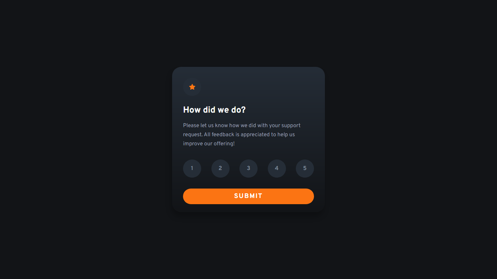

# Frontend Mentor - Interactive rating component solution

This is a solution to the [Interactive rating component challenge on Frontend Mentor](https://www.frontendmentor.io/challenges/interactive-rating-component-koxpeBUmI). Frontend Mentor challenges help you improve your coding skills by building realistic projects.

## Table of contents

- [Overview](#overview)
  - [The challenge](#the-challenge)
  - [Screenshot](#screenshot)
  - [Links](#links)
- [My process](#my-process)
  - [Built with](#built-with)
  - [What I learned](#what-i-learned)
- [Author](#author)

## Overview

An interactive rating component using HTML, CSS and Vanilla JavaScript

### The challenge

Users should be able to:

- View the optimal layout for the app depending on their device's screen size
- See hover states for all interactive elements on the page
- Select and submit a number rating
- See the "Thank you" card state after submitting a rating

### Screenshot



### Links

- Solution URL: [https://www.frontendmentor.io/solutions/interactive-rating-componenthtml-css-and-vanilla-javascript-O-VCeazKar](https://www.frontendmentor.io/solutions/interactive-rating-componenthtml-css-and-vanilla-javascript-O-VCeazKar)
- Live Site URL: [https://interactive-rating-component-chi-one.vercel.app](https://interactive-rating-component-chi-one.vercel.app/)

## My Process

### Built with

- Semantic HTML5 markup
- CSS custom properties
- Flexbox
- CSS Grid
- Mobile-first workflow

### What I learned

```html
<h1>Some HTML code I'm proud of</h1>
```

```css
.proud-of-this-css {
  color: papayawhip;
}
```

```js
const proudOfThisFunc = () => {
  console.log("🎉");
};
```

## Author

<!-- - Website - [Add your name here](https://www.your-site.com) -->

- Twitter - [@iamzaidmohammed](https://www.twitter.com/iamzaidmohammed)
- Frontend Mentor - [@zaidmohammed7](https://www.frontendmentor.io/profile/zaidmohammed7)
